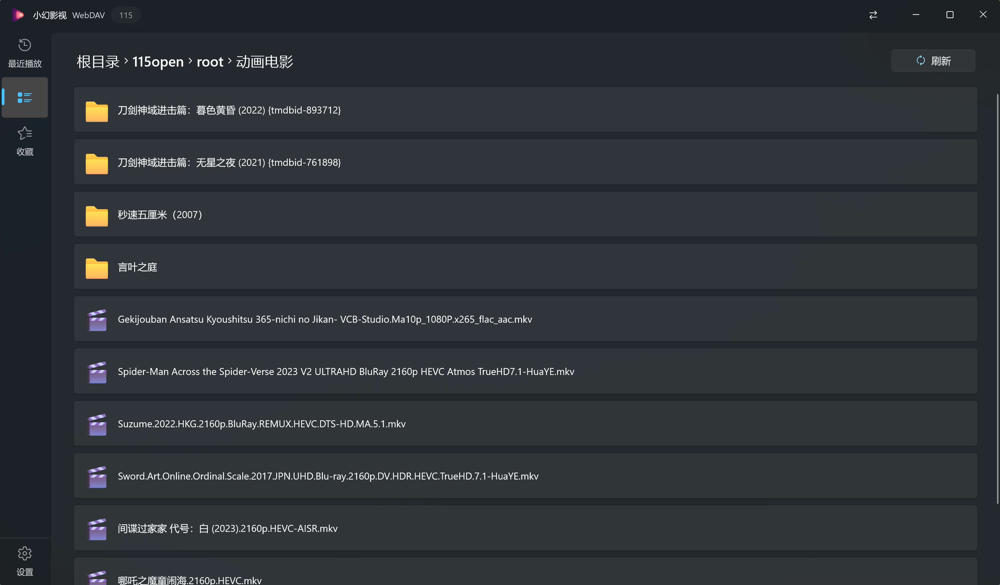

  

# 小幻影视

畅享观影时光

    <a title="Get From Microsoft Store" href="https://apps.microsoft.com/detail/9PFZCKRHW0BC?launch=true&mode=full" target="_blank">
    下载应用
    </a>
    |
    <a title="Document" href="https://player.richasy.net/overview" target="_blank">使用文档</a>

## 总览

小幻影视是一个专注于 Windows 桌面端的影视媒体播放器，能够以符合 Fluent Design 的用户界面为你提供高质量的观影体验。

它所支持的服务分为两大类型：

### 海报墙

即 `Emby` 和 `Jellyfin` 服务，它们部署在本地或服务端，连接数据源后具备视频刮削能力（联网获取视频相关封面/海报/角色等信息），应用据此生成元素丰富的用户界面，也就是俗称的 `海报墙`

### 文件浏览

包括 `本地文件`，`WebDAV`，`SMB` 和 `115 网盘`。

它们以文件列表的方式展示，用户点选文件以播放，符合传统的文件浏览体验。

> [!TIP]
> 也许你希望小幻影视支持对上述服务进行视频刮削，但这是一件费时费力的事，目前开发者的精力有限，无力承担此项开发工作。

## 播放

应用内置 libmpv，如果你了解 MPV 配置，可以在此基础上实现丰富的自定义视觉效果。如果你不了解也没关系，应用提供了开箱即用的播放配置，大部分情况下你不需要调整。

> [!Warning]
> 如果你似懂非懂，从其他地方获取了 mpv 配置，那我劝你谨慎。测试期间有相当多的黑屏/崩溃都因为使用了错误的配置引起。  
> 这部分的问题无法由应用这一侧处理，也难以定位问题，所以在你没有明确的目的，同时也不了解你的配置时，请什么都不要做，使用应用的预设配置即可。

## 弹幕

应用支持哔哩哔哩和弹弹Play两大弹幕源，这两个服务更多用于动漫资源。如果你有其它资源的需求，应用也支持你自定义弹弹 Play API 地址。

> [!Tip]
> 自定义弹幕 API 要求兼容 [弹弹Play API v2](https://api.dandanplay.net/swagger/index.html#/) 的 API 规范，可以考虑部署 [anoraker/abetsy](https://hub.docker.com/r/anoraker/abetsy)

其中，如果你用哔哩哔哩弹幕源，最好在设置里登录你的B站账号，因为大量资源只有大会员才能够访问，不然你可能只能获得前两分钟试看版本的弹幕。